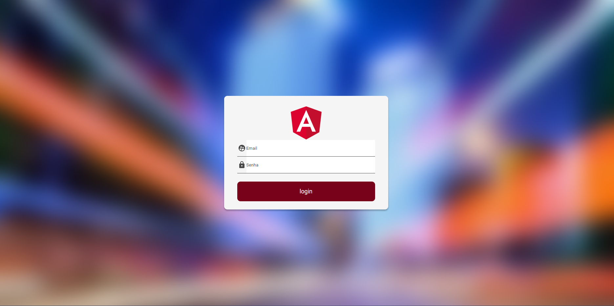

<h1 align="center">
  &#x1F4F1; Curso Angular Authenticator Frontend Prototype &#x1F4F1;
</h1>

<div style="display:flex; justify-content:space-between;" align="center">
   

  

  
  
  <a href="https://www.codacy.com/manual/Gabriel4420/curso-angular-auth-front?utm_source=github.com&amp;utm_medium=referral&amp;utm_content=Gabriel4420/curso-angular-auth-front&amp;utm_campaign=Badge_Grade">
    
  </a>
  
  


  <a href="https://www.linkedin.com/in/gabriel-rodrigues-perez-2069b072/">
    
  </a>
</div>

---

<p align="center">
  
</p>

---

# Indice

 🚀 [Sobre o Projeto](#rocket-sobre-o-projeto)
 👨‍💻️ [Tecnogias utilizadas](#%EF%B8%8F-tecnogias-utilizadas)
 📦️ [Como utilizar o projeto](#%EF%B8%8F-como-utilizar-o-projeto)
---
<br>

## 🚀 Sobre o Projeto

A proposta do projeto, é o aprendizado sobre os varios recursos que o angular oferece,bem como alguns plugins nativos:
<div style="display:flex;margin-right:10px;">
<div style="margin-right:10px;">
 ✅ Guards <br/>
 ✅ Services<br/>
 ✅ Routings<br/>
 </div>
 <div>
 ✅ Criação de components<br/>
 ✅ Criação de modulos<br/>
 ✅ Tipagem de retornos <br/>
 </div>
</div>

---

## 👨‍💻️ Tecnogias utilizadas

O projeto foi desenvolvido utilizando as seguintes tecnologias:

- [Angular](https://angular.io/docs)


### Padronização de código

  - [ESLint](https://eslint.org/)
  - [Prettier](https://prettier.io/)
  - :mouse: [Editor Config](https://editorconfig.org/)

### IDE

  - [Visual Studio Code](https://code.visualstudio.com/)

---

## 📦️ Como utilizar o projeto

Para copiar o projeto, utilize os comandos:

```bash
  # Clonar o repositório
  ❯ git clone https://github.com/Gabriel4420/curso-angular-auth-front.git

```
Para instalar as dependências e iniciar o projeto, você pode utilizar o npm ou yarn:

**Utilizando npm**

```bash
  # verificar as dependências
  ❯ npm install

  # Iniciar o projeto
  ❯ npm start
```

**Utilizando yarn**

```bash
  # Atualizar as dependências
  ❯ yarn

  # Iniciar o projeto
  ❯ yarn start
```

---

<h4 align="center">
  Feito com ❤️ por Gabriel Rodrigues 👋️ <a href="mailto:gabriel_rodrigues_perez@hotmail.com">Entre em contato!</a>
</h4>

<div align="center">

  <a href="https://www.linkedin.com/in/gabriel-rodrigues-perez-2069b072/">
    
  </a>
  <a href="https://www.facebook.com/gabriel.rodrigues.perez">
    
  </a>
  <a href="https://www.instagram.com/gabriel_rodrigues_perez/">
    
  </a>
  
  
</div>
